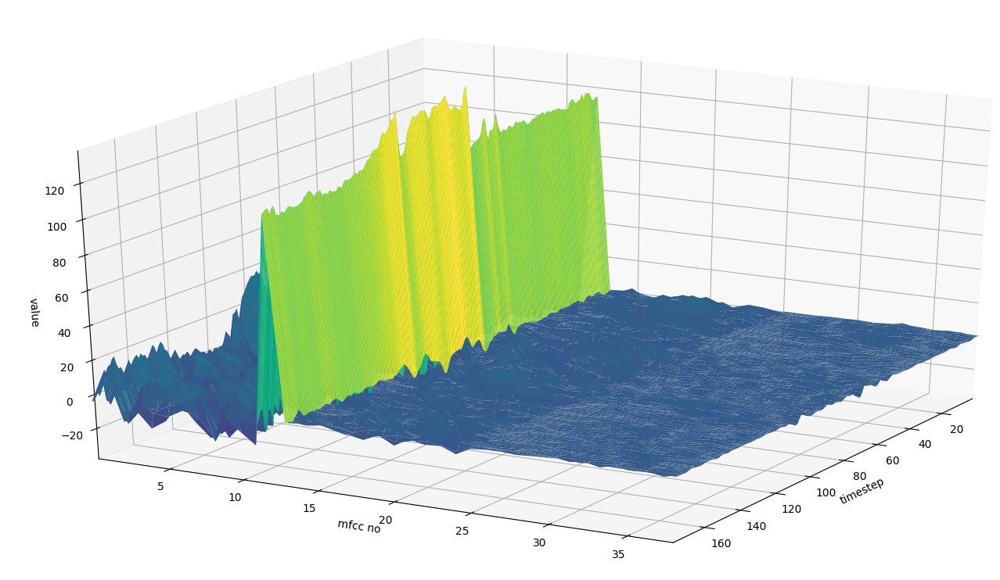
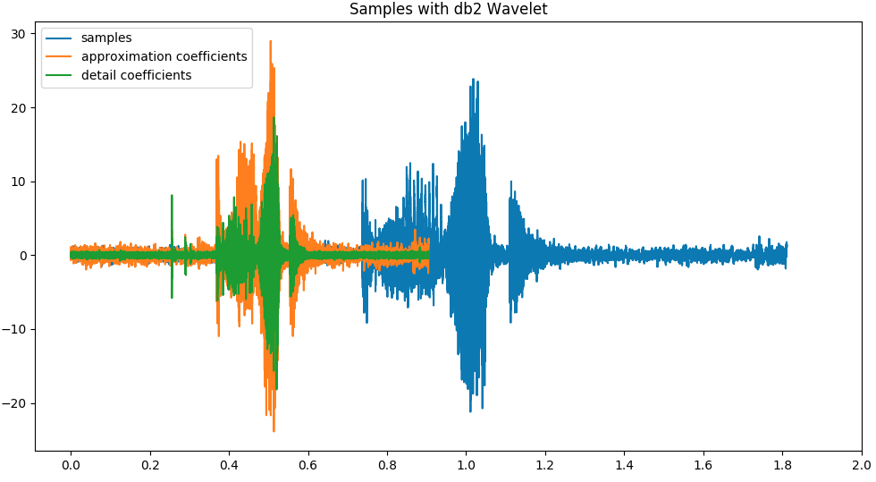

This script plots the samples from speech01.wav (50 times amplified).
It's also plotting the MFCCs (including deltas and deltadeltas) (without amplification).

## MFCCs
The MFCCs in outmfcc_D_A.csv were extracted with this command:

    time SMILExtract -C config/MFCC12_0_D_A.conf -I speech01.wav -csvoutput outmfcc_D_A.csv

This config file is included with OpenSMILE.

## Samples
The samples were extracted with sox:

    sox speech01.wav -t dat out.txt
    # csv-like
    # sed -E wegen Mac OS
    cat out.txt | sed -E -e 's/^ +//g' -e 's/  +/;/g' > samples.csv

## Result (Commit 2ab3)

## Result (Commit f542)

Check out the code for visualising a 3D array in this commit. I couldn't find an easier solution anywhere else yet but I'm sure it CAN be done easier than this ...

## Result (Commit 0925)

Wavelets are calculated with the pywt library.